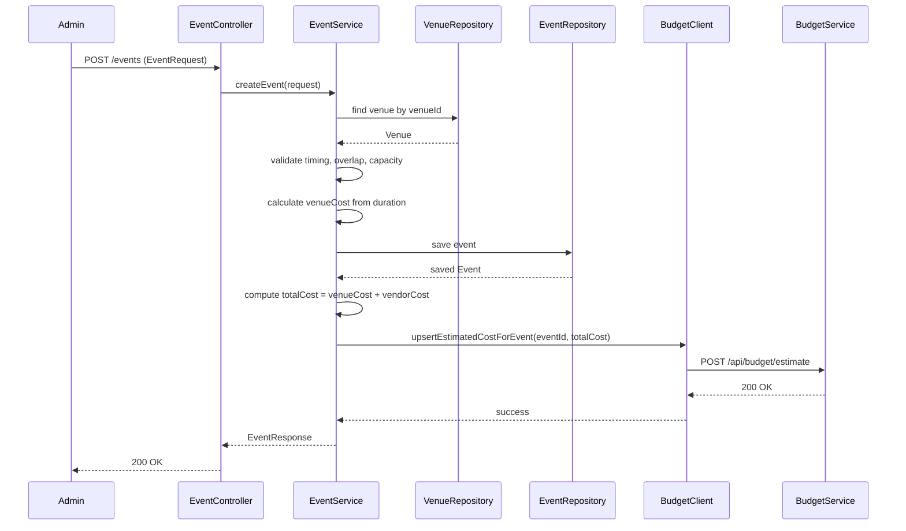

# EventZen Backend

A comprehensive Spring Boot backend for an event management platform.

## 1. Project Overview

EventZen is a backend system for managing end-to-end event operations, from planning and venue scheduling to vendor assignment and ticket booking. It is designed for both real-world developer onboarding and academic evaluation with clear business rules, layered architecture, and secure API design.

Primary goals:

- Manage users with role-aware access (Admin and Customer).
- Manage events, including scheduling, venue assignment, capacity, and pricing.
- Manage venues and vendors for event logistics.
- Support ticket-based booking workflows with capacity enforcement.
- Integrate with an external Budget Service microservice for estimated cost, expense tracking, and revenue synchronization.

## 2. Architecture

EventZen follows a classic layered architecture:

1. Controller Layer: Defines REST endpoints, input validation trigger points (`@Valid`), and role-based access via `@PreAuthorize`.
2. Service Layer: Encapsulates business logic (time conflict checks, capacity rules, ticket availability, password changes, booking lifecycle, integration orchestration).
3. Repository Layer: Uses Spring Data JPA repositories for persistence and query abstractions.

### Technology and Data Access

- Spring Boot 3 (web, validation, security)
- Spring Data JPA + Hibernate ORM
- MySQL as the primary transactional database

### Microservice Integration (Budget Service)

EventZen integrates with a separate Budget Service through REST calls using Spring `RestClient`.

Integration capabilities:

- Upsert event estimated cost during event planning/vendor updates.
- Set total budget for an event.
- Fetch budget by event.
- Add and delete expenses.
- Sync event revenue based on confirmed bookings.
- Readiness health dependency check for budget service availability.

### Containerization

- A Dockerfile is provided for backend image build and runtime.
- Root-level Docker Compose orchestrates EventZen backend, MySQL, frontend, budget service, and budget database.

## 3. Features and Capabilities

### Authentication and Authorization

- User registration and login with JWT issuance.
- Role model: `ADMIN`, `CUSTOMER`.
- Method-level security for privileged operations.

### Event Management

- Create, update, and cancel events.
- Search events by date/location.
- List upcoming events.
- Venue-based event listing.

### Venue Management

- Create, update, delete venues (admin).
- Active venue listing and filtered search by location/capacity.

### Vendor Management

- Create, update, soft-delete vendors (admin).
- Role-aware listing (admins can view all; customers get active-only).
- Attach and remove vendors per event with duplicate prevention.

### Booking System

- Ticket booking by customers.
- Customer booking history.
- Booking cancellation.
- Admin booking oversight, status updates, and event booking summary.

### Operational and Platform Features

- Readiness endpoint (`/readiness`) that reports Budget Service dependency health.
- Soft-delete semantics:
  - Events are cancelled via status update (`CANCELLED`) instead of hard delete.
  - Vendors are deactivated (`is_active=false`) instead of hard delete.
- Role-aware data visibility:
  - Vendor listing returns all vendors for admins, active-only vendors for customers.
  - Event listing exposes only visible statuses (`ACTIVE`, `SOLD_OUT`).
- Automatic lifecycle/status updates:
  - Event moves between `ACTIVE` and `SOLD_OUT` based on ticket availability.
  - Booking status transitions (`CONFIRMED`, `CANCELLED`) update seat inventory.
- Cost/revenue synchronization with Budget Service on planning and booking changes.
- CORS configuration through environment variables for frontend integration.

### Budget Integration

- Admin APIs to interact with budget and expense records.
- Automatic revenue sync from confirmed bookings.
- Automatic estimated cost sync from event and vendor changes.

## 4. Security

### Password Security

- Passwords are encoded with BCrypt (`BCryptPasswordEncoder`).
- Additional application-level salting is applied via `PasswordSecurityService`.
- Legacy password migration support is implemented during login.

### JWT Authentication

- Stateless authentication using JWT.
- JWT filter (`OncePerRequestFilter`) validates token and populates security context.
- Public routes: `/auth/register`, `/auth/login`, `/readiness`.

### RBAC and Route Protection

- Route-level and method-level authorization with `@PreAuthorize`.
- Admin operations restricted to `hasRole('ADMIN')`.
- Customer booking operations restricted to `hasRole('CUSTOMER')`.
- All non-public endpoints require authentication.

## 5. Validations and Business Rules

EventZen enforces validation at DTO, service, and persistence levels.

### Input Validation (DTO-level)

- Required fields with `@NotNull` / `@NotBlank`.
- Email format validation with `@Email`.
- Numeric constraints such as `@Min` and `@DecimalMin`.
- Size constraints for description/metadata fields.

### Core Business Rules

- Unique email for users:
  - Enforced in business logic (`existsByEmail`) and DB unique column on `users.email`.
- Event date/time consistency:
  - `startTime` must be before `endTime`.
- Venue availability conflict prevention:
  - Overlapping active events at the same venue and timeslot are blocked.
- Capacity constraints:
  - Event max capacity cannot exceed venue capacity.
  - Event max capacity cannot be reduced below already confirmed seats.
- Booking limits:
  - Seats per booking must be at least 1.
  - Booking cannot exceed remaining capacity.
  - Booking for ended events is rejected.
- Vendor assignment rules:
  - Duplicate vendor IDs in one attach request are rejected.
  - Duplicate event-vendor mappings are blocked.
  - Only active vendors can be attached to events.
- Data integrity checks:
  - Event status and ticket availability are synchronized when bookings/events change.
  - Vendor-event relation has a DB uniqueness constraint on `(event_id, vendor_id)`.

### Calculation and Derived-Field Rules

The backend performs several deterministic calculations to keep pricing and planning consistent.

#### 1) Venue Cost from Event Duration

- Formula:

```text
durationMinutes = endTime - startTime
durationHours = durationMinutes / 60
venueCost = venue.pricePerHour * durationHours
```

- Implementation details:
  - `durationHours` is computed with decimal precision.
  - `venueCost` is rounded/scaled to 2 decimal places.

#### 2) Booking Price Calculation

- Formula:

```text
pricePerTicket = event.ticketPrice
totalPrice = pricePerTicket * numberOfSeats
```

- Both `pricePerTicket` and `totalPrice` are stored with 2-decimal precision.

#### 3) Event Total Planning Cost

- Formula:

```text
vendorCost = sum(cost of all vendors attached to event)
totalCost = venueCost + vendorCost
```

- This planning total is synced to Budget Service as estimated cost.

#### 4) Ticket Availability Tracking

- On event create/update:

```text
ticketAvailable = maxCapacity - confirmedBookedSeats
```

- On booking confirmation/cancellation or admin status change:

```text
ticketAvailable = ticketAvailable - confirmedSeatDelta
```

- If `ticketAvailable == 0`, event status becomes `SOLD_OUT`; otherwise `ACTIVE` (unless cancelled/completed).

#### 5) Remaining Seats in Booking Summary

- Formula:

```text
totalBookedSeats = sum(numberOfSeats where booking status = CONFIRMED)
remainingSeats = max(maxCapacity - totalBookedSeats, 0)
```

#### 6) Event Revenue Synchronization

- Formula:

```text
revenue = sum(totalPrice where booking status = CONFIRMED)
```

- Revenue is pushed to Budget Service whenever booking state changes affect confirmed totals.

### Sequence Flow: Create Event -> Cost Calculation -> Budget Sync



### Assumptions and Constraints

- Event timing assumes same-day start and end times (`startTime < endTime` on one `eventDate`).
- Pricing assumes non-negative monetary values and 2-decimal financial precision.
- `venue.pricePerHour` must exist to compute `venueCost`; missing value rejects event create/update.
- Capacity constraints are strict: confirmed bookings are never allowed to exceed `maxCapacity`.
- Event overlap checks are enforced for active scheduling at the same venue/time window.
- Budget sync is treated as part of operational consistency; downstream failure returns integration error (`503`).
- Visibility is role- and status-aware (for example customers only see active vendors and visible events).

### Glossary of Domain Terms

- `venueCost`: Venue rental cost computed from venue hourly rate and event duration.
- `vendorCost`: Sum of all vendor assignment costs linked to an event.
- `totalCost`: Aggregate planning cost for an event (`venueCost + vendorCost`).
- `revenue`: Sum of confirmed booking `totalPrice` values for an event.
- `ticketAvailable`: Remaining sellable seats for an event after confirmed booking adjustments.

### Error Handling Approach

- Centralized `@RestControllerAdvice` handles validation, domain, security, integration, and generic exceptions.
- Proper HTTP status mapping (400, 401, 404, 409, 503, 500).

## 6. API Documentation

Base URL (local): `http://localhost:8080`

Authentication header for protected routes:

```http
Authorization: Bearer <jwt-token>
```

### A. Admin APIs

#### User Administration

| Method | URL | Description |
|---|---|---|
| GET | `/admin/users` | List all users |
| GET | `/users/{id}` | Get user by ID |
| DELETE | `/users/{id}` | Delete user by ID |

#### Event Administration

| Method | URL | Description |
|---|---|---|
| POST | `/events` | Create event |
| PUT | `/events/{id}` | Update event |
| DELETE | `/events/{id}` | Cancel event |

#### Venue Administration

| Method | URL | Description |
|---|---|---|
| POST | `/venues` | Create venue |
| PUT | `/venues/{id}` | Update venue |
| DELETE | `/venues/{id}` | Delete venue |

#### Vendor Administration

| Method | URL | Description |
|---|---|---|
| POST | `/vendors` | Create vendor |
| PUT | `/vendors/{id}` | Update vendor |
| DELETE | `/vendors/{id}` | Soft-delete vendor |
| POST | `/events/{eventId}/vendors` | Attach vendors to event |
| DELETE | `/events/{eventId}/vendors/{vendorId}` | Remove vendor from event |

#### Booking Administration

| Method | URL | Description |
|---|---|---|
| GET | `/bookings` | List all bookings |
| GET | `/bookings/event/{eventId}` | List bookings by event |
| PUT | `/bookings/{id}/status` | Update booking status |
| GET | `/bookings/event/{eventId}/summary` | Event booking summary |

#### Budget Administration

| Method | URL | Description |
|---|---|---|
| GET | `/admin/budget/event/{eventId}` | Fetch budget by event |
| POST | `/admin/budget/set` | Set total budget for event |
| GET | `/admin/budget/expense/event/{eventId}` | List expenses by event |
| POST | `/admin/budget/expense` | Add expense |
| DELETE | `/admin/budget/expense/{id}` | Delete expense |

### B. User APIs

| Method | URL | Description |
|---|---|---|
| POST | `/auth/register` | Register user |
| POST | `/auth/login` | Login and receive JWT |
| GET | `/auth/me` | Get current profile |
| PUT | `/auth/change-password` | Change current password |
| PUT | `/users/me` | Update own profile |
| GET | `/events` | List visible events |
| GET | `/events/{id}` | Get event by ID |
| GET | `/events/search?date=YYYY-MM-DD&location=...` | Search events |
| GET | `/events/upcoming` | List upcoming events |
| GET | `/events/venue/{venueId}` | Events by venue |
| GET | `/venues` | List active venues |
| GET | `/venues/{id}` | Get venue by ID |
| GET | `/venues/search?location=...&capacity=...` | Search venues |
| GET | `/vendors` | List vendors (active-only for customers) |
| GET | `/vendors/{id}` | Get vendor by ID (active-only for customers) |
| GET | `/events/{eventId}/vendors` | List vendors assigned to event |
| POST | `/bookings` | Book tickets (customer role) |
| GET | `/bookings/my` | View own bookings |
| DELETE | `/bookings/{id}` | Cancel own booking |

### C. Integration APIs

#### Exposed integration proxy (EventZen -> Budget Service)

- `/admin/budget/*` endpoints listed above are EventZen-managed integration endpoints.

#### Internal outbound calls from EventZen to Budget Service

These are invoked through `BudgetClient`:

| Method | Downstream URL (Budget Service) | Purpose |
|---|---|---|
| POST | `/api/budget/estimate` | Upsert estimated event cost |
| POST | `/api/budget/set` | Set total budget |
| POST | `/api/budget/revenue/{eventId}` | Sync event revenue |
| GET | `/api/budget/{eventId}` | Fetch budget snapshot |
| GET | `/api/expense/event/{eventId}` | Fetch expenses |
| POST | `/api/expense` | Add expense |
| DELETE | `/api/expense/{id}` | Delete expense |

### Calculation-Critical APIs (Quick Reference)

These endpoints directly trigger or depend on pricing/capacity calculations:

| Method | URL | Calculation Impact |
|---|---|---|
| POST | `/events` | Computes `venueCost`, initializes ticket availability, syncs estimated cost |
| PUT | `/events/{id}` | Recomputes `venueCost`, revalidates capacity, syncs estimated cost |
| POST | `/events/{eventId}/vendors` | Recomputes vendor and total planning cost, syncs estimate |
| DELETE | `/events/{eventId}/vendors/{vendorId}` | Recomputes planning cost, syncs estimate |
| POST | `/bookings` | Computes booking `totalPrice`, updates inventory, syncs revenue |
| DELETE | `/bookings/{id}` | Restores inventory for confirmed bookings, syncs revenue |
| PUT | `/bookings/{id}/status` | Applies status transition inventory/revenue effects |
| GET | `/bookings/event/{eventId}/summary` | Returns computed seat totals and remaining capacity |

## 7. Database Design

### Main Entities

- `User`
- `Event`
- `Venue`
- `Vendor`
- `Booking`
- `EventVendor` (join entity for event-vendor assignments)

### Key Relationships

- One `Venue` can be used by many `Event` records (`Event` -> `Venue`: many-to-one).
- One `User` can create many `Booking` records (`Booking` -> `User`: many-to-one).
- One `Event` can have many `Booking` records (`Booking` -> `Event`: many-to-one).
- `Event` and `Vendor` are many-to-many via `EventVendor`.
- `EventVendor` enforces uniqueness on `(event_id, vendor_id)` to prevent duplicate assignments.

## 8. Error Handling

### Global Exception Handling

Implemented using `@RestControllerAdvice` with dedicated handlers for:

- Validation errors (`MethodArgumentNotValidException`) -> `400 Bad Request`
- Resource not found -> `404 Not Found`
- Duplicate resource -> `409 Conflict`
- Bad credentials -> `401 Unauthorized`
- Budget integration failures -> `503 Service Unavailable`
- Unexpected exceptions -> `500 Internal Server Error`

### Standard Response Patterns

EventZen returns JSON error payloads with consistent key usage:

```json
{
  "error": "Descriptive message"
}
```

Validation errors return field-to-message maps:

```json
{
  "email": "Email must be valid",
  "password": "size must be between 6 and 2147483647"
}
```

## 9. Setup and Installation

### Prerequisites

- Java 17+
- Maven 3.9+
- MySQL 8+
- Docker and Docker Compose (optional, recommended for full stack)

### Local Run (Backend only)

1. Clone repository and move to backend folder.
2. Create `.env` in backend folder (copy from `.env.example`).
3. Ensure MySQL database exists and credentials match environment variables.
4. Build and run:

```bash
mvn clean install
mvn spring-boot:run
```

Application default port: `8080`

### Environment Variables

At minimum configure:

```env
SPRING_DATASOURCE_URL=jdbc:mysql://localhost:3306/eventzen?useSSL=false&allowPublicKeyRetrieval=true&serverTimezone=UTC
SPRING_DATASOURCE_USERNAME=eventzen
SPRING_DATASOURCE_PASSWORD=YourStrongDBPassword

JWT_SECRET=YourLongRandomJWTSecret
JWT_EXPIRATION=86400000

APP_CORS_ALLOWED_ORIGINS=http://localhost:5173,http://localhost:3000

# Budget service integration
BUDGET_SERVICE_BASE_URL=http://localhost:4001
INTERNAL_SERVICE_KEY=eventzen-internal-service-key-change-me

# Optional datasource startup timeout (ms)
SPRING_TIMEOUT=1
```

### Docker Run (Full stack)

From repository root:

```bash
docker compose up --build
```

Services include:

- EventZen backend (`8080`)
- Frontend (`3000`)
- MySQL (`3306`)
- Budget Service and its PostgreSQL database

## 10. Future Enhancements

- Event analytics dashboard (booking trends, occupancy, revenue insights).
- Asynchronous integration/event updates via message broker (Kafka/RabbitMQ).
- Caching and performance tuning for high-traffic reads.
- API versioning and OpenAPI/Swagger generation.
- Rate limiting and audit logging for security hardening.
- Horizontal scaling with service discovery and centralized config.
- Multi-tenant support for organizer-level isolation.

## 11. Tech Stack

- Spring Boot 3.2
- Spring Security (JWT + RBAC)
- Spring Data JPA / Hibernate
- MySQL
- REST APIs
- Docker / Docker Compose
- Maven

---

## Quick Start Checklist

1. Configure `.env` with DB/JWT/Budget values.
2. Start MySQL (or run full stack with Docker Compose).
3. Run backend using Maven.
4. Register/login via `/auth/*` endpoints.
5. Use JWT token for protected APIs.
